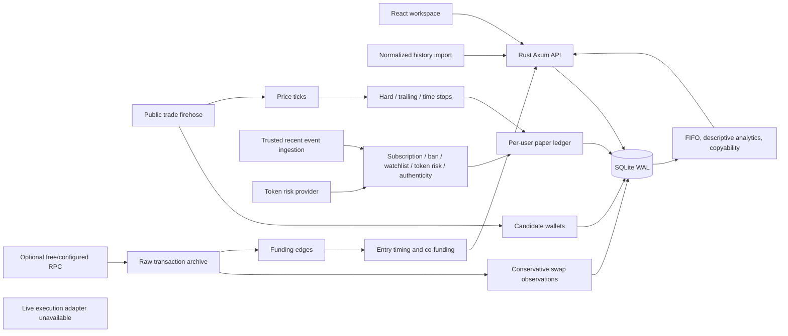

# Architecture and implementation boundary

## Layout

- `backend/src/main.rs`: HTTP routes, access control, persistence, subscription records, paper policy, event fanout.
- `backend/src/analytics.rs`: pure wallet accounting, descriptive statistics and the follower-adjusted copyability simulation.
- `backend/src/rpc.rs`: optional RPC acquisition and conservative observation extraction.
- `backend/src/discovery.rs`: optional public-firehose collector for candidate wallets and price ticks.
- `backend/src/risk_token.rs`: cached token safety assessment and the pre-entry gate.
- `backend/src/ticks.rs`: independent price path and tick-evaluated hard/trailing/time exits.
- `backend/src/cluster.rs`: funding-graph extraction, co-funding sets and entry-timing authenticity.
- `backend/src/tests.rs`: route-level integration tests using in-memory SQLite.
- `frontend/src/main.tsx`: application routes/views, forms, charting and API interactions.
- `frontend/src/styles.css`: custom responsive design, no external UI kit or CDN fonts.
- `fixtures/demo-trades.json`: 360 deterministic synthetic events, not real wallet performance.
- `frontend/tests`: Playwright user workflows and screenshots.

## Persistence and access

SQLite WAL persists users, hashed sessions/API keys, trade events, raw transaction snapshots, watchlists, paper positions, processed markers, plans, payment records, RPC collection timestamps, login attempts, audit records, candidate wallets and their observations, cached token risk assessments, price ticks and funding edges. Schema changes are additive: tables use `CREATE TABLE IF NOT EXISTS` and the one added column is applied with an `ALTER TABLE` whose already-present outcome is expected, not an error. There is no migration framework. A single process owns a mutex-protected connection. This keeps small local workflows transactionally coherent, but it is not a high-throughput distributed design.

Passwords use Argon2 with per-password random salts. Sessions use random opaque tokens; only SHA-256 digests are stored. Browser cookies are HttpOnly and SameSite=Strict. Secure cookies are configurable for HTTPS. Bans disable paper execution and revoke all stored tokens; auth also checks ban state. API keys cannot authorize administrator routes. Cross-site browser writes are rejected; no permissive CORS is enabled. API responses carry no-store and security headers.

Subscription expiry is checked at protected requests and automatic paper-event distribution. A failed/duplicate subscription record rolls back access changes. All plans currently grant the same access class. Complimentary access contributes zero to recorded revenue. No payment processor is contacted and no payment proof is automatically verified.

## Why live accounts are not connected

No official third-party delegated trading authorization was established for Axiom/Fomo from the sources reviewed. The Connections page links to official material and describes actual readiness; it does not simulate OAuth success. Pump's onchain interface is documented but needs a signer and transport. This build neither stores wallet keys nor asks users to export platform session cookies.

To implement a real adapter, first obtain the provider's supported contract: auth grants/scopes, revocation, account identifiers, event transport, order semantics, rate limits, fill status, fee payer, and terms of automated use. Alternatively choose a direct onchain wallet execution design explicitly, including how unattended authority is granted and revoked.

## Work remaining for the requested full service

1. **Global ingestion:** a live supported feed or node/indexer, program-specific decoders, historical coverage, liquidity indexing, retries/backfill, commitment/reorg policies and precise ordering. The discovery collector is a free prototype firehose limited to newly created mints it happens to see; a dropped connection silently loses observations, and it is not global coverage. Token-state indexing is now partially covered by the cached risk gate.
2. **Predictive research:** honest train/test separation, baselines, calibrated uncertainty and prospective shadow results. Follower execution outcomes are now *simulated* against observed prices across a delay ladder, which is a retrospective and optimistic measurement, not validation. The implemented heuristic still has no demonstrated predictive edge.
3. **Authorized execution:** official platform adapters or a separately designed signing service; signed user mandates, spend limits, transaction simulation, idempotent intents, confirmations/expiry, reconciliation, queue backpressure and market-capacity limits.
4. **Execution feedback:** actual fills, partial fills, failed fees, fees paid by users, token balances and stale-price rejection. Independently monitored exits now exist in paper form as tick-evaluated stops; they run on observed trade prices, not executable quotes, and model no price impact for our own size.
5. **Commercial billing:** real checkout/payment verification, signed webhooks, renewals, cancellations/refunds, quota enforcement and differentiated plan entitlements. Local plans/verified payment records already work.
6. **Public-service operations:** TLS, rate limiting by authenticated principal/IP, email verification/recovery, admin MFA, database backups/recovery, monitoring, migrations, retention policy, secrets management and load tests.
7. **Scale:** async database pool/PostgreSQL, bounded worker queues, indexed incremental wallet accounting, immutable signal snapshots, account-specific order queues. The current historical replay is quadratic in history length, and the copyability simulation rebuilds a price series per request; both are sized for fixtures. A platform-wide per-mint exposure cap is also missing, so a large follower base would become its own price impact. Do not mistake Rust for an automatic latency guarantee.
8. **Accessibility:** keyboard navigation and responsive views exist; full screen-reader and modal focus-trapping audits remain.

These are unimplemented components or validation needs, not hidden behind environment flags that turn paper trading into live trading.
